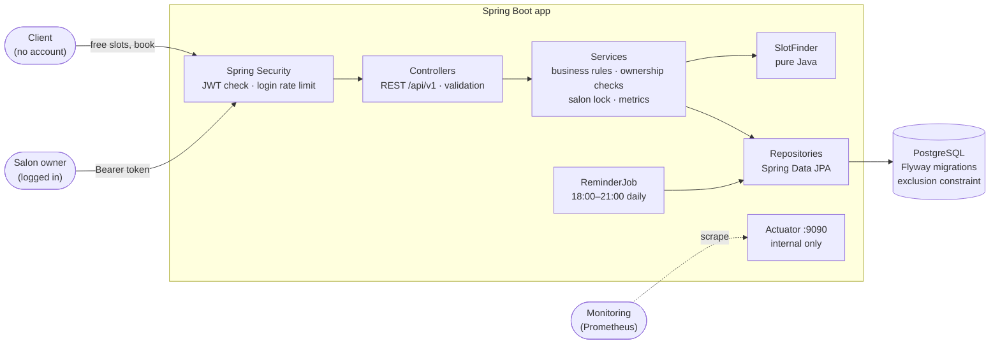
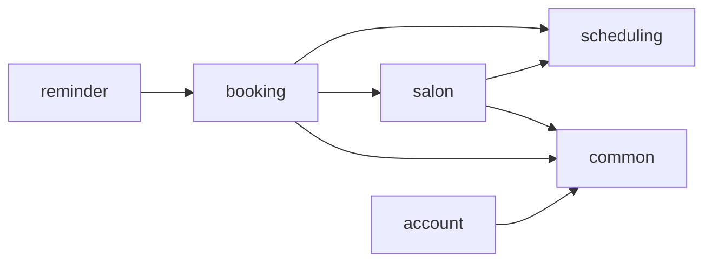
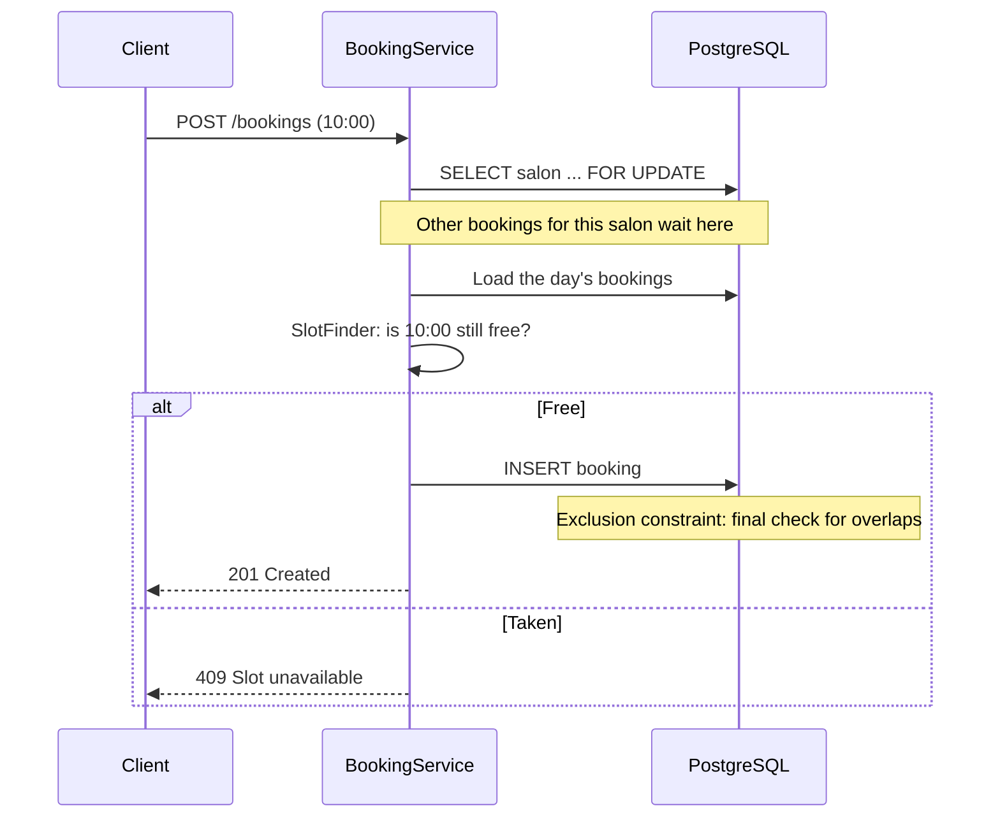
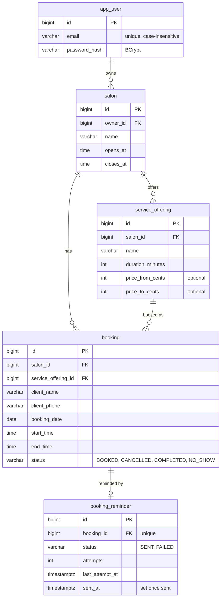

# Salon Booking API

[](https://github.com/afunemma/salon-booking-api/actions/workflows/ci.yml)
[](https://github.com/afunemma/salon-booking-api/security/code-scanning)
[](https://salon-booking-api-wguy.onrender.com/swagger-ui.html)

A REST API that lets clients book appointments at salons (barbers, hair, braids, nails and beauty). It is built with Java and Spring Boot.

## Try it live

**👉 [https://salon-booking-api-wguy.onrender.com/swagger-ui.html](https://salon-booking-api-wguy.onrender.com/swagger-ui.html)**

> ⏳ The demo runs on a free server. An uptime monitor keeps it awake, so it normally responds in under a second. Right after a restart or a new deploy, give it **up to 3 minutes** to start.

A 2-minute tour in Swagger UI (click an endpoint → **Try it out** → **Execute**):

1. **See free times as a client:** `GET /api/v1/salons/{salonId}/free-slots` with `salonId` **1** (the Demo Salon), `serviceId` **1**, and tomorrow's date.
2. **Book one, without an account:** `POST /api/v1/salons/1/bookings` with one of those times. Book the same time again to see the `409 Slot unavailable` response.
3. **Become a salon owner:** `POST /api/v1/auth/register`, then `POST /api/v1/auth/login`. Copy the `accessToken`, click **Authorize** 🔒 at the top of the page, and paste it in.
4. **Manage your own salon:** create one (`POST /api/v1/salons`), add a service, book it, and open your day view (`GET .../bookings`). Then try the Demo Salon's day view: you get `403 Forbidden`, because it isn't yours.

Demo data may be reset at any time. Please don't enter real personal information.

## Why this project

This project started with real customer research. A local barber told me:

- **3 of about 30 clients a week don't show up.** That's roughly 10% of his income lost.
- He's busy cutting hair all day and **doesn't read booking messages**.
- Clients book by WhatsApp, calls and walk-ins, usually 1–2 days ahead.

The goal is to let clients book themselves and to cut no-shows, without adding admin work for the salon. The questions I use to interview more salons are in [`docs/salon-interview-script.md`](docs/salon-interview-script.md).

## Tech stack

| | |
|---|---|
| Language | Java 25 |
| Framework | Spring Boot 4 |
| API | REST with Spring MVC, Bean Validation, OpenAPI / Swagger UI (springdoc) |
| Security | Spring Security, JWT (OAuth 2 resource server), BCrypt |
| Database | PostgreSQL 18, with Flyway migrations and Spring Data JPA |
| Build | Maven (wrapper included) |
| Testing | JUnit 5, AssertJ, Mockito, Testcontainers (real PostgreSQL in Docker) |
| Quality | ArchUnit (architecture rules), JaCoCo (coverage minimums), Spring Java Format, CodeQL |
| Monitoring | Spring Boot Actuator, Micrometer, Prometheus |
| Deployment | Docker (Java 25 AOT cache), Render, Neon PostgreSQL |
| CI | GitHub Actions: builds and tests every push |

## Architecture



Requests pass through Spring Security, then controllers (HTTP and validation), services (business rules, ownership checks and transactions) and repositories (database). The slot-finding logic is plain Java with no framework dependencies.

### Package dependencies

Dependencies point one way only, enforced by [`ArchitectureTest`](src/test/java/io/github/afunemma/salonbooking/ArchitectureTest.java) ([ADR-0005](docs/adr/0005-package-by-feature-with-enforced-boundaries.md)).



### Booking a slot

How a booking stays safe when two clients press "Book" at the same moment ([ADR-0004](docs/adr/0004-prevent-double-bookings-with-lock-and-constraint.md)):



### Data model



## Run it

You need Java 25 or newer and Docker.

```bash
./mvnw verify                   # format check, all tests, coverage check (starts a throwaway PostgreSQL in Docker)
./mvnw spring-javaformat:apply  # auto-format the code
./mvnw spring-boot:run  # start the app on http://localhost:8080
```

`spring-boot:run` starts PostgreSQL from `compose.yaml` automatically and stops it when the app stops. Flyway creates the tables on startup.

Locally, login tokens are signed with a random key generated at startup, so you log in again after a restart. In any real deployment, set `APP_SECURITY_JWT_SECRET` (at least 32 characters).

If an older local database fails a new migration, reset it with `docker compose down -v`. This deletes local data only.

- Swagger UI (try every endpoint in the browser): <http://localhost:8080/swagger-ui.html>
- Health checks: <http://localhost:8080/livez> and <http://localhost:8080/readyz>
- Metrics (internal port, Prometheus format): <http://localhost:9090/actuator/prometheus>

## API

Clients book **without an account**. Salon owners register, log in, and send the token as `Authorization: Bearer <token>`. In Swagger UI, use the **Authorize** button.

| Method | Endpoint | Who | What it does |
|---|---|---|---|
| `POST` | `/api/v1/auth/register` | Anyone | Register a salon owner account |
| `POST` | `/api/v1/auth/login` | Anyone | Log in and get a token (valid for 1 hour) |
| `POST` | `/api/v1/salons` | 🔒 Owner | Create a salon with opening hours |
| `GET` | `/api/v1/salons` | 🔒 Owner | List your salons |
| `GET` | `/api/v1/salons/{salonId}` | Anyone | Get a salon |
| `POST` | `/api/v1/salons/{salonId}/services` | 🔒 Owner | Add a service, e.g. a 35-minute haircut at R50–R100 |
| `GET` | `/api/v1/salons/{salonId}/services` | Anyone | List a salon's services |
| `GET` | `/api/v1/salons/{salonId}/free-slots?serviceId=&date=` | Anyone | Free start times for a service on a date |
| `POST` | `/api/v1/salons/{salonId}/bookings` | Anyone | Book a free slot |
| `GET` | `/api/v1/salons/{salonId}/bookings?date=` | 🔒 Owner | The salon's day view |
| `POST` | `/api/v1/salons/{salonId}/bookings/{bookingId}/cancel` · `/complete` · `/no-show` | 🔒 Owner | Update a booking |

🔒 = the salon's owner only. Other logged-in owners get `403 Forbidden`.

Example: book a haircut.

```bash
curl -X POST localhost:8080/api/v1/salons/1/bookings -H 'Content-Type: application/json' \
  -d '{"serviceId": 1, "clientName": "Thabo", "clientPhone": "082 123 4567", "date": "2030-01-07", "startTime": "10:00"}'
```

```json
{"id": 1, "serviceId": 1, "serviceName": "Haircut", "clientName": "Thabo", "clientPhone": "082 123 4567",
 "date": "2030-01-07", "startTime": "10:00:00", "endTime": "10:35:00", "status": "BOOKED"}
```

Errors use the standard [RFC 9457 Problem Details](https://www.rfc-editor.org/rfc/rfc9457) format, and validation errors name every invalid field:

```json
{"status": 409, "title": "Slot unavailable", "detail": "10:15 is not available on 2030-01-07 for Haircut"}

{"status": 400, "title": "Invalid request", "detail": "One or more fields are invalid",
 "errors": {"clientName": "must not be blank", "clientPhone": "must be a phone number, e.g. 082 123 4567"}}
```

### Design notes

- **Layers:** controller (HTTP) → service (business rules, transactions) → repository (database). Controllers never touch entities; they use request and response records, so the database can change without breaking API clients.
- **Business rules are checked on the server:** no bookings in the past, only times the salon actually offers, and a salon can only use its own services and bookings.
- **Time zone:** "today" and "now" come from an injected `Clock` set to `Africa/Johannesburg`, so the rules stay correct on a UTC server and tests can freeze time.
- **Versioned API:** all endpoints live under `/api/v1`, so a future `/api/v2` can change the contract without breaking existing clients.
- **Errors:** only the application's own exceptions (e.g. `SlotUnavailableException`) become 4xx responses. Anything unexpected is logged in full and returns a generic 500, so bugs aren't disguised as client mistakes and internal details never leak.
- **Typed configuration:** all `app.*` settings bind to one validated record (`AppProperties`). An invalid value such as `app.booking.slot-step=0m` stops the app at startup.
- **Null safety:** every package is `@NullMarked` ([JSpecify](https://jspecify.dev)), so anything that can be null is explicitly marked `@Nullable`, and the IDE warns about possible `NullPointerException`s.
- **Logging without personal data:** bookings, cancellations and no-shows are logged by id. Client names and phone numbers are never logged, in line with South Africa's POPIA privacy law.

## How free slots are found

`SlotFinder` walks through the day from opening time in fixed steps (e.g. every 15 minutes). It keeps a start time only if the service finishes by closing time and doesn't overlap an existing booking.

Two appointments overlap when **each one starts before the other ends**:

```java
start.isBefore(otherEnd) && otherStart.isBefore(end)
```

Edge cases covered by tests:

- back-to-back bookings (10:00–10:35, then 10:35)
- long services that only fit in big gaps (5-hour braids)
- late opening hours that must not wrap past midnight

## Appointment reminders

Clients get a reminder **the evening before** their appointment, to cut no-shows without the salon doing anything ([ADR-0009](docs/adr/0009-evening-reminders-with-a-scheduled-job.md)).

> Hi Thabo, a reminder of your Haircut at Sipho's Cuts tomorrow, Monday 7 January, at 10:00. If you can't make it, please let the salon know.

- **When:** a scheduled job runs every hour from **18:00 to 21:00** (salon time) and reminds each client with an active booking tomorrow who hasn't been reminded yet.
- **Never twice, never lost:**
  - Every attempt is recorded in `booking_reminder`, which allows one row per booking.
  - A failed send is retried on the next run, and one failure doesn't stop the others.
- **No transaction during sending:** messages are sent between short database transactions, so a slow provider never holds a connection.
- **Delivery channel:** behind a `ReminderSender` interface. For now `LoggingReminderSender` only logs the reminder (booking id and the last 3 phone digits). WhatsApp or SMS costs money per message and will be a separate implementation.
- **Free-plan friendly:** the job queries the database only 4 times a day, so Neon can sleep.
- **Tests:** [`ReminderJobIntegrationTest`](src/test/java/io/github/afunemma/salonbooking/reminder/ReminderJobIntegrationTest.java) runs the job against real PostgreSQL. It checks the message text, that cancelled and later bookings are skipped, that a second run sends nothing, and that a failed send is retried.

## Database design

The schema lives in versioned Flyway migrations (`src/main/resources/db/migration`). Hibernate only *validates* that the entities match it, and never changes the database itself.

```
salon ──< service_offering
  │             │
  └──< booking >┘
```

- **Prices are stored in cents** (R50 is `5000`) to avoid rounding errors, as a range, because many salons quote "R50 to R100".
- **The database enforces its own rules** with `CHECK` constraints: opening time before closing time, a price range that doesn't go backwards, and a valid booking status. Bad data is rejected even if the application has a bug.
- **Booking end times are stored**, not just calculated, so the database can check for overlapping bookings (see below).
- `SlotFinder` works on plain `TimeRange` values and has no database dependency, so the core logic stays easy to test.

## Preventing double bookings

Booking works like this: check that the slot is free, then save it. On its own, that has a **race condition**. If two clients book 10:00 at the same moment, both checks can pass before either booking is saved.

I wrote [a test](src/test/java/io/github/afunemma/salonbooking/booking/ConcurrentBookingTest.java) that sends 20 simultaneous requests for overlapping times. Before the fix, **10 of the 20 succeeded**. Now exactly one does, protected by two layers:

1. **Pessimistic lock.** `book()` first locks the salon's row (`SELECT ... FOR UPDATE`). Bookings for the same salon wait their turn for a few milliseconds, so the second request sees the first one's booking and gets a clear `409 Slot unavailable`.
2. **Database exclusion constraint** (a safety net, in [`V2__prevent_overlapping_bookings.sql`](src/main/resources/db/migration/V2__prevent_overlapping_bookings.sql)). PostgreSQL itself rejects any two active bookings in the same salon whose time ranges overlap (`&&`). This holds even for code paths that skip the lock.

```sql
EXCLUDE USING gist (salon_id WITH =, booking_date WITH =, timerange(start_time, end_time) WITH &&)
WHERE (status = 'BOOKED')
```

I also tried the constraint alone. It stopped the double bookings, but under heavy contention PostgreSQL reported deadlocks between the waiting inserts, and clients got server errors. Taking the lock first keeps the requests in order and avoids the deadlocks. Locking per salon is fine at salon scale, where a salon handles a few bookings a minute, not thousands a second.

## Security design

Full reasoning: [ADR-0006](docs/adr/0006-stateless-jwt-auth-for-owners-only.md).

- **Tokens:** stateless JWT login using Spring Security's built-in resource server support, not hand-written token code. Tokens are signed with HMAC-SHA256, hold only the user id, and expire after 1 hour.
- **Ownership:** checked in one place (`SalonService.findOwnedSalon`). Owners can only see and change their own salon. Client names and phone numbers are visible only to that salon's owner.
- **Passwords:** hashed with BCrypt and 12 to 72 characters long. They are never stored, returned or logged.
- **Login gives nothing away:** a wrong password and an unknown email return an identical response in the same time (a dummy hash check), so the login form can't be used to discover registered emails.
- **The signing key comes from the environment,** never from a committed file.
- **Login rate limiting** ([ADR-0007](docs/adr/0007-in-memory-login-rate-limiting.md)): at most 20 attempts per minute per IP address, and 5 failed attempts per email before that email is paused. A successful login resets the count. Blocked attempts get `429 Too Many Requests` with a `Retry-After` header.
- **Errors:** security errors (`401`, `403`) use the same Problem Details format as every other error.
- **Tests:** [`SecurityIntegrationTest`](src/test/java/io/github/afunemma/salonbooking/SecurityIntegrationTest.java) covers missing, garbage, expired and forged tokens, password hashing, and one owner trying to read or change another owner's salon.

## Monitoring

Business metrics are exported in Prometheus format on an **internal port (9090)** that is never published to the internet:

| Metric | Why it matters |
|---|---|
| `salon_bookings_made_total` | Booking volume |
| `salon_bookings_rejected_total{reason}` | Clients who couldn't get the slot they wanted (`slot_unavailable`, `slot_taken_concurrently`, `date_in_past`) |
| `salon_bookings_status_changed_total{status}` | Cancellations, completions and **no-shows**, the problem salons said costs them the most |
| `salon_reminders_total{result}` | Reminders `sent` or `failed`. Repeated failures mean the messaging channel is down |
| `salon_auth_logins_total{result}` | `success`, `failure`, `rate_limited`. A spike in failures or rate limits is a sign of password guessing |

Liveness and readiness checks (`/livez`, `/readyz`) are public on the main port for the hosting platform.

## Deployment

The live demo runs on free plans: the app on [Render](https://render.com) and PostgreSQL on [Neon](https://neon.com). See [ADR-0008](docs/adr/0008-free-hosting-on-render-and-neon.md) for the reasoning and measurements.

- **`Dockerfile`:**
  - a multi-stage build
  - runs as a non-root user
  - a Java 25 AOT cache created by a training run during the build, so startup is about 25% faster on a small CPU
  - tuned to fit 512 MB
- **`render.yaml`:** the exact Render settings, as code. The live service was created in Render's dashboard with these values, because Render's menu didn't offer Blueprint setup at the time. New `main` commits deploy only after CI passes.
- **The `prod` profile:** settings come from environment variables:

  | Variable | Value |
  |---|---|
  | `SPRING_DATASOURCE_URL` | `jdbc:postgresql://<neon-direct-host>/<db>?sslmode=require` |
  | `SPRING_DATASOURCE_USERNAME` / `SPRING_DATASOURCE_PASSWORD` | From Neon |
  | `APP_SECURITY_JWT_SECRET` | Generated by Render |
- **The `demo` profile** creates a sample salon ("Demo Salon", id 1) with services, so visitors can look up free slots and book straight away.
- **CI also builds the Docker image,** so a broken Dockerfile never reaches the host.
- **Kept awake by an uptime monitor:** a free [UptimeRobot](https://uptimerobot.com) monitor calls `/livez` every 5 minutes, so Render never puts the app to sleep and visitors skip the cold start. It also emails an alert if the demo goes down. `/livez` doesn't touch the database, so Neon can still sleep.

Run the production image locally:

```bash
docker build -t salon-booking-api .
docker run -p 8080:8080 -e SPRING_PROFILES_ACTIVE=prod,demo \
  -e SPRING_DATASOURCE_URL=jdbc:postgresql://host.docker.internal:5432/salon_booking \
  -e SPRING_DATASOURCE_USERNAME=salon -e SPRING_DATASOURCE_PASSWORD=salon \
  -e APP_SECURITY_JWT_SECRET=$(openssl rand -base64 32) salon-booking-api
```

## Engineering practices

- **Architecture rules are tests.** [`ArchitectureTest`](src/test/java/io/github/afunemma/salonbooking/ArchitectureTest.java) fails the build if the design erodes:
  - no package cycles
  - controllers never touch repositories or entities
  - the `scheduling` logic stays free of Spring and JPA
  - constructor injection only
  - logging only through SLF4J
- **Coverage minimums.** JaCoCo fails the build below 85% line or 75% branch coverage. Each CI run shows the numbers in its summary and keeps the full HTML report as a downloadable artifact.
- **Consistent formatting.** Spring Java Format checks every file, and CI fails on unformatted code.
- **Decisions are written down.** [Architecture Decision Records](docs/adr/README.md) explain the key choices, the trade-offs and the rejected alternatives.
- **Pull requests.** Changes go through a branch and a pull request, where CI, CodeQL and the checks above must pass before merging.

## Roadmap

- [x] Slot-finding logic with unit tests
- [x] CI pipeline with GitHub Actions
- [x] PostgreSQL + Flyway migrations, running in Docker, with Testcontainers tests
- [x] REST API for salons, services, free slots and bookings, with OpenAPI docs
- [x] Prevent double bookings when two clients book the same slot at once (lock + exclusion constraint, with a concurrency test)
- [x] Owner login (JWT), with each salon's data visible only to its owner. Clients book without an account
- [x] Evening-before appointment reminders, retried on failure (delivery channel still a stand-in)
- [ ] Clients cancel their own booking from a link in the reminder
- [ ] Deliver reminders by WhatsApp or SMS
- [ ] Staff members with their own schedules
- [x] Specific error types, structured logging without personal data, typed config (PR #1)
- [x] Architecture tests, coverage minimums, formatting and ADRs (PR #2)
- [x] Architecture diagrams, business metrics (Prometheus) and login rate limiting
- [x] Docker image and live demo on Render + Neon ([try it](https://salon-booking-api-wguy.onrender.com/swagger-ui.html))

## Security

Security issues can be reported privately; see [SECURITY.md](SECURITY.md). The repository uses secret scanning, Dependabot and CodeQL.

## Copyright

© 2026 afunemma. All rights reserved.

This code is public so it can be reviewed as part of my portfolio. You're welcome to read it, but please don't copy, redistribute or use it commercially without permission.
